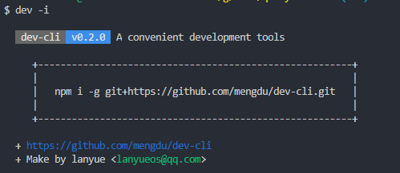
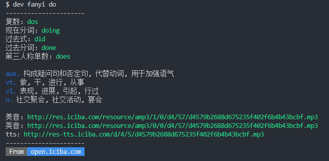
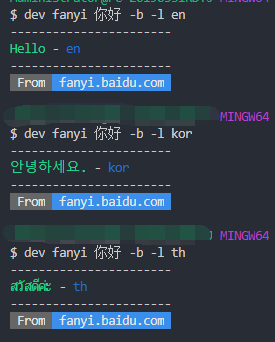

# dev-cli

> 一个适合自己使用cli工具。

**install**

```ls
npm i -g git+https://github.com/mengdu/dev-cli.git
```

## TODO

 - [x] serve 静态服务器
 - [x] fanyi 翻译工具


## serve

创建一个静态文件服务器

```ls
dev serve [options] <dir> <port>
```

**options:**

 + `-p, --port <port>` 指定端口，默认 `8080`
 + `-d, --dir <dir>` 指定文件夹，默认 `.`
 + `-o, --open` 自动打开浏览器，默认 false
 + `-w, --watch` 开启监听文件变化，刷新页面，默认 false
 + `--ui` 开启 ，默认 `Browsersync` ui 页面 ，默认false
 + `--ui-port <port>` Browsersync ui 服务端口 (default: 3001)
 + `-c, --config <config>` 指定 [Browsersync 配置文件](https://browsersync.io/docs/options)

## fanyi

翻译工具

```ls
dev fanyi [options] <w>
```

**options:**

 + `-b, --baidu` 使用百度翻译，默认单词使用 [爱词霸](http://open.iciba.com) 翻译，如果句子使用百度翻译
 + `-l, --lang <lang>` 指定翻译到具体语言，需要结合 `-b` 参数; 默认翻译成 zh，中文翻译成 en


> 因为百度接口有免费翻译字数限制，所以请需要用的朋友自己申请下百度的翻译appid和secret；爱词霸翻译key申请，请到
> http://open.iciba.com
> 申请到key可以在用户跟目录里面配置一个 .dev-cli 的文件里


**.dev-cli** 文件

```conf
FANYI_CIBA_KEY = xxxx # 爱词霸key
BAIDU_FANYI_APPID = xxx # 百度翻译appid
BAIDU_FANYI_SECRET = xxx # 百度翻译secret
BAIDU_DEFAULT_TO = kor # 百度翻译结果语言，默认zh/en
```






